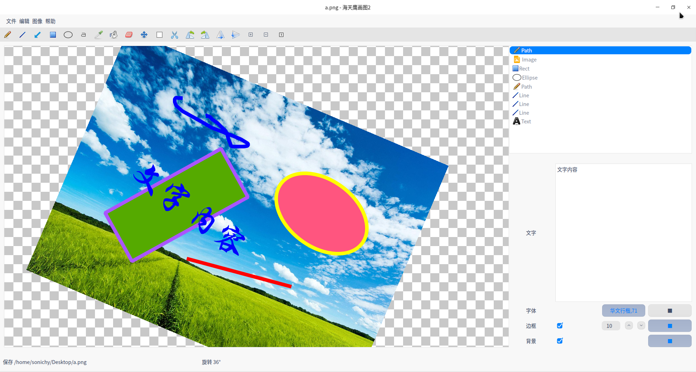

# Qt 海天鹰画图2
基于 QGraphicsItem 的迷你画图程序。  
已编译好的 HTYPaint 程序适用于 64 位 Linux 系统 Qt5 环境，双击运行，其他版本自行编译。

### 功能规划
拖动过程中绘制  
鼠标拖动修改尺寸  
~~铅笔工具~~  
~~矩形工具~~  
~~椭圆工具~~  
~~文字工具~~  
~~拖动绘图~~  
~~导入图片~~  
~~修改图元边框颜色和填充颜色~~  
~~旋转图元~~  
~~快捷键微调图元尺寸~~  
~~修改图片尺寸~~  
~~图元放大和缩小~~  
~~修改字体~~  
~~图元水平和垂直镜像~~  
~~粘贴剪贴板图片~~
